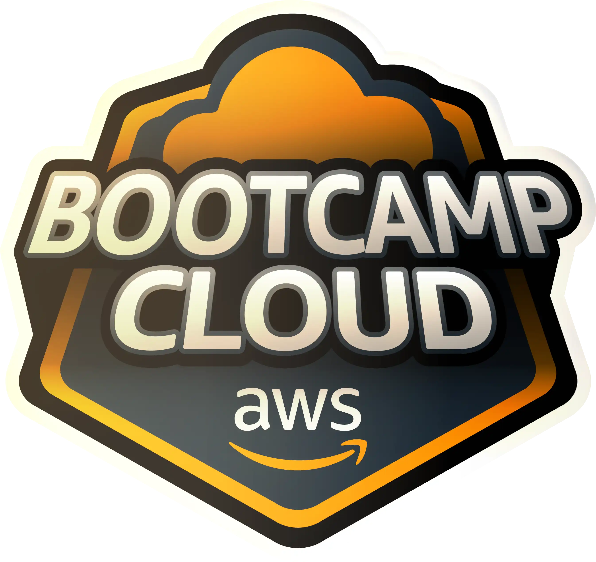

# Bootcamp-Cloud-AWS

- 34 cursos.
- 4 desafios de projeto.
- 0 desafios de código.
- 1 live.
- 5 Mentorias.
- Carga Horária 73h.
- Datas: 16/03 a 19/05/23 Concluído em 26/04/23✅
- Certificado https://www.dio.me/certificate/B68E7C65

Prepare-se Para a Jornada: BootCamp Cloud AWS - Amazon Web Services 
Composto por 73 horas de conteúdo que vai do básico até o preparatório para certificações. A trilha é composta por cursos exclusivos AWS e mentorias ao vivo com experts certificados pela plataforma. Uma grande oportunidade de conhecer as certificações AWS e ter destaque no currículo.

Obs; Os conteúdos do bootcamp ainda se encontram em off, pois o conhecimento, se adquire no silêncio, serão revisados e estudados, logo, em breve, atualizados.

